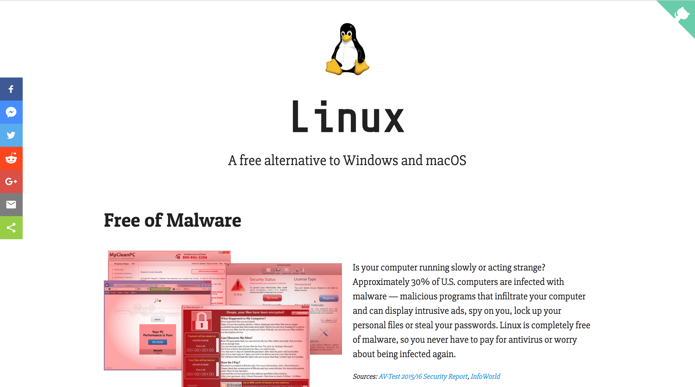

# Promote Linux (https://www.promotelinux.org)

A website for promoting the GNU/Linux operating system to regular PC users with little technical knowledge.
**Issues and pull requests are much appreciated.**

Copyright © 2017-2018 Jeremy Potter. Licensed under the [GNU Affero Public License 3.0](https://www.gnu.org/licenses/agpl-3.0.en.html).
